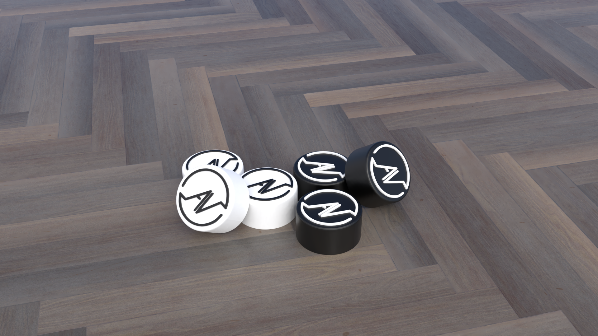

# AmbivistPedalToppers
Blender and stl files for custom guitar pedal footswitch toppers.

## Files

The 'PedalTopperPrint.blend' file is the most up to date version of the single topper. This is ready to print when exported as an stl, the exported file comes out to around 35MB so I can't include it in the repo. The other blend files are examples of the toppers in scenes for rendering, as well as an alternate design where the logo is recessed.

## License

[MIT License](./LICENSE)